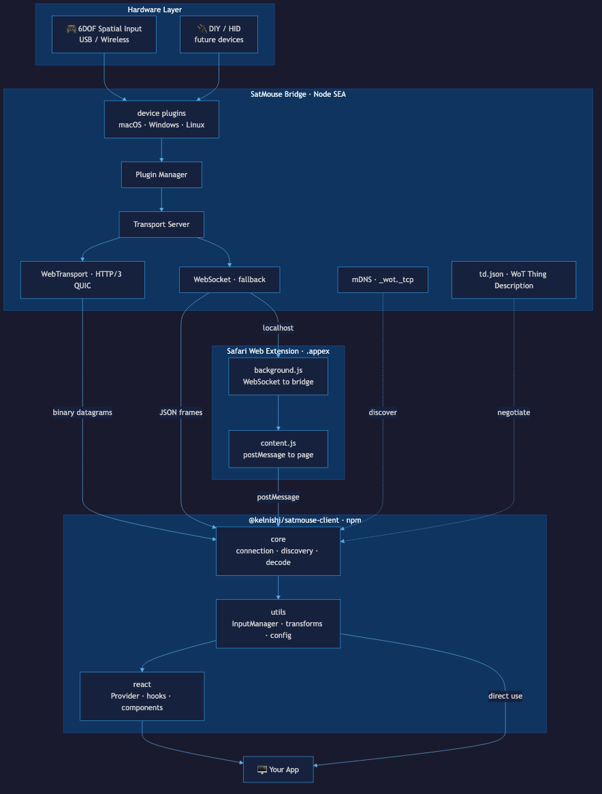

# SatMouse

A bridge application that streams 6DOF spatial input device data to apps over the network. Zero-config discovery via mDNS and W3C Web of Things, with WebTransport (HTTP/3 QUIC) for low-latency streaming and WebSocket fallback.



## Quick Start

### Run the bridge

Download the latest release for your platform:

| Platform | Download |
|---|---|
| macOS (Apple Silicon) | [SatMouse.app](https://github.com/kelnishi/SatMouse/releases/latest) |
| Linux (x64) | [satmouse-linux-x64.tar.gz](https://github.com/kelnishi/SatMouse/releases/latest) |
| Windows (x64) | [satmouse-win32-x64.tar.gz](https://github.com/kelnishi/SatMouse/releases/latest) |

Or install via npm:

```bash
npx @kelnishi/satmouse
```

On macOS, double-click `SatMouse.app` — a 🛰 icon appears in the menu bar. No dock icon, no terminal needed.

### Connect from your app

```bash
npm install @kelnishi/satmouse-client
```

```typescript
import { SatMouseConnection } from "@kelnishi/satmouse-client";
import { InputManager } from "@kelnishi/satmouse-client/utils";

const connection = new SatMouseConnection();
const manager = new InputManager();
manager.addConnection(connection);

manager.onSpatialData((data) => {
  console.log(data.translation, data.rotation);
});

await connection.connect();
```

Or with React:

```tsx
import { SatMouseProvider, useSpatialData } from "@kelnishi/satmouse-client/react";

function App() {
  return (
    <SatMouseProvider>
      <Scene />
    </SatMouseProvider>
  );
}

function Scene() {
  const data = useSpatialData();
  // data.translation.x/y/z, data.rotation.x/y/z
}
```

### Try the reference client

With the bridge running, open http://localhost:4444/client/ — a Three.js demo with a 6DOF-controlled cube.

## How It Works

1. **Launch** — SatMouse detects connected spatial input devices via platform-specific plugins
2. **Broadcast** — Advertises `_wot._tcp` via mDNS with a WoT Thing Description
3. **Connect** — Clients fetch `/td.json`, pick WebTransport or WebSocket
4. **Stream** — 6DOF translation + rotation data flows at device rate (~60-120 Hz)

Clients can also connect via the `satmouse://` URL scheme:
- `satmouse://connect?host=192.168.1.42` — connect to a specific bridge
- `satmouse://launch` — launch the app (or open the download page if not installed)

## Compatible Hardware

### Built-in plugins

| Plugin | Devices | macOS | Windows | Linux |
|---|---|---|---|---|
| **SpaceMouse** | SpaceNavigator, SpaceMouse Pro/Wireless/Compact/Enterprise, SpacePilot | 3DconnexionClient.framework | 3DxWare SDK | libspnav |
| **SpaceFox** | SpaceFox, SpaceFox Wireless | 3DconnexionClient.framework | 3DxWare SDK | libspnav |
| **Orbion** | Orbion rotary dial | 3DconnexionClient.framework | 3DxWare SDK | libspnav |
| **CadMouse** | CadMouse Pro/Compact (buttons only) | 3DconnexionClient.framework | 3DxWare SDK | libspnav |
| **HID** | Space Mushroom, Xbox/PlayStation controllers, any USB HID | node-hid | node-hid | node-hid |

### Adding a hardware plugin

SatMouse has a plugin architecture so hardware vendors and community contributors can add support for new devices. Each plugin implements the [`DevicePlugin`](src/devices/types.ts) interface:

```typescript
import { DevicePlugin, type DeviceInfo, type SpatialData } from "./devices/types.js";

export class MyDevicePlugin extends DevicePlugin {
  readonly id = "my-device";
  readonly name = "My 6DOF Device";
  readonly supportedPlatforms: NodeJS.Platform[] = ["darwin", "win32", "linux"];

  async isAvailable(): Promise<boolean> {
    // Return true if the device SDK/driver is installed on this machine
  }

  async connect(): Promise<void> {
    // Open the device and start emitting events:
    //   this.emit("spatialData", { translation: {x,y,z}, rotation: {x,y,z}, timestamp })
    //   this.emit("buttonEvent", { button: 0, pressed: true, timestamp })
    //   this.emit("deviceConnected", deviceInfo)
    //   this.emit("deviceDisconnected", deviceInfo)
  }

  disconnect(): void {
    // Release device resources
  }

  getDevices(): DeviceInfo[] {
    // Return currently connected devices
  }
}
```

Then register it in [`src/main.ts`](src/main.ts):

```typescript
deviceManager.registerPlugin(new MyDevicePlugin());
```

#### Plugin structure

```
src/devices/plugins/my-device/
  index.ts          # Plugin class (implements DevicePlugin)
```

For devices that use a shared native SDK (like 3Dconnexion devices), you can also create a shared driver under `src/devices/drivers/` — see [`src/devices/drivers/connexion/`](src/devices/drivers/connexion/) for an example.

#### HID devices

For USB HID devices, you don't need to write a plugin — add a mapping profile to the existing HID plugin instead:

```typescript
import { HIDPlugin, type HIDDeviceMapping } from "./devices/plugins/hid/index.js";

const myMapping: HIDDeviceMapping = {
  name: "My Device",
  vendorId: 0x1234,
  productId: 0x5678,
  axes: [
    { sourceAxis: 0, target: "tx" },
    { sourceAxis: 1, target: "ty" },
    { sourceAxis: 2, target: "tz" },
    { sourceAxis: 3, target: "rx", invert: true },
    { sourceAxis: 4, target: "ry", deadZone: 0.05 },
    { sourceAxis: 5, target: "rz", scale: 2.0 },
  ],
  buttons: [
    { sourceButton: 0, targetButton: 0 },
    { sourceButton: 1, targetButton: 1 },
  ],
};

const hid = new HIDPlugin([myMapping]);
deviceManager.registerPlugin(hid);
```

#### Submitting a plugin

1. Fork the repo
2. Add your plugin under `src/devices/plugins/<name>/`
3. Register it in `src/main.ts`
4. Add your device to the compatibility table in this README
5. Open a PR

## Compatible Clients

| Client | Type | Status |
|---|---|---|
| [Kelcite](https://kelcite.app) | 3D modeling web app | Integrated |
| [Reference Client](http://localhost:4444/client/) | Three.js demo (built into SatMouse) | Included |
| Any app using `@kelnishi/satmouse-client` | Custom | Build your own |

### Client SDK

**`@kelnishi/satmouse-client`** — three tree-shakeable modules:

| Module | Import | Purpose |
|---|---|---|
| **core** | `@kelnishi/satmouse-client` | Connection, discovery, binary decode. Zero dependencies. |
| **utils** | `@kelnishi/satmouse-client/utils` | InputManager, transforms (flip, sensitivity, dominant, dead zone, axis remap), settings persistence |
| **react** | `@kelnishi/satmouse-client/react` | `<SatMouseProvider>`, `useSpatialData()`, `<SettingsPanel>`, `<DeviceInfo>`, `<DebugPanel>` |

Any app that speaks WebSocket or WebTransport can connect to SatMouse — the client SDK is optional but provides typed APIs, auto-discovery, and React integration out of the box.

## Development

```bash
# Install dependencies
npm install

# Generate dev TLS certs (required for WebTransport)
npm run generate-certs

# Run in development mode
npm run dev

# Build client bundle
npm run build:client
```

## Endpoints

| Endpoint | Protocol | Purpose |
|---|---|---|
| `http://localhost:4444/td.json` | HTTP | WoT Thing Description |
| `http://localhost:4444/client/` | HTTP | Reference web client |
| `ws://localhost:4444/spatial` | WebSocket | Spatial data stream (fallback) |
| `https://localhost:4443` | WebTransport | Spatial data stream (primary) |
| `http://localhost:4444/api/device` | HTTP | Connected device info |

## Specifications

- [WoT Thing Description](specs/td.json) — W3C Web of Things TD
- [AsyncAPI](specs/asyncapi.yaml) — AsyncAPI 3.0 event protocol
- [JSON Schemas](specs/schemas/) — Data payload schemas
- [Wire Protocol](docs/protocol.md) — Binary and JSON formats
- [Discovery](docs/discovery.md) — mDNS + WoT handshake flow

## License

MIT
